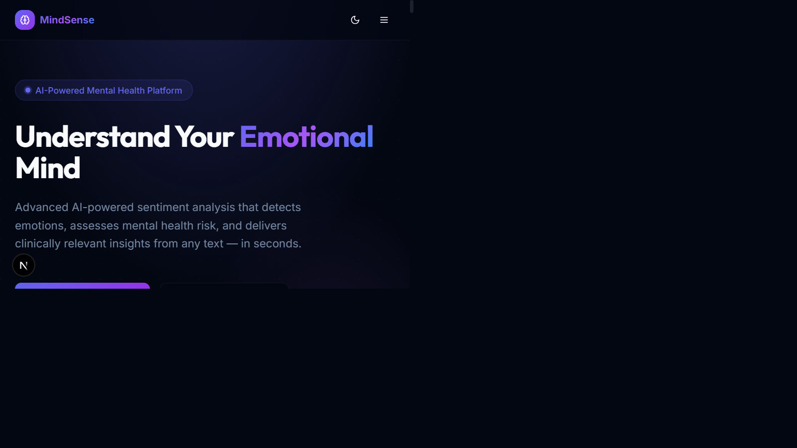
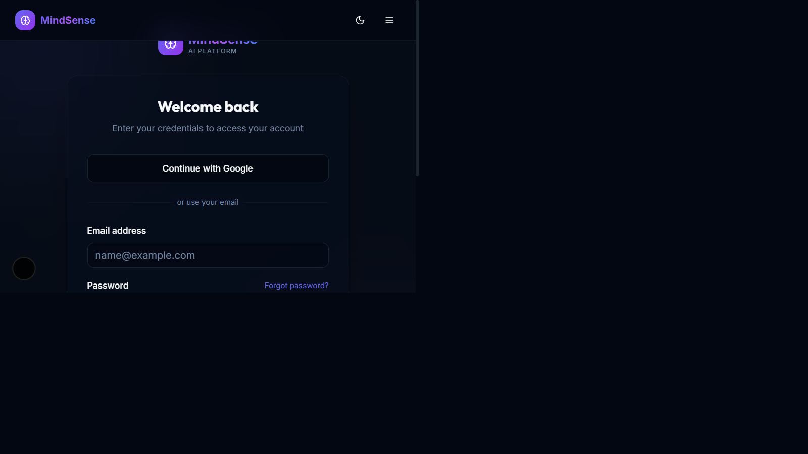
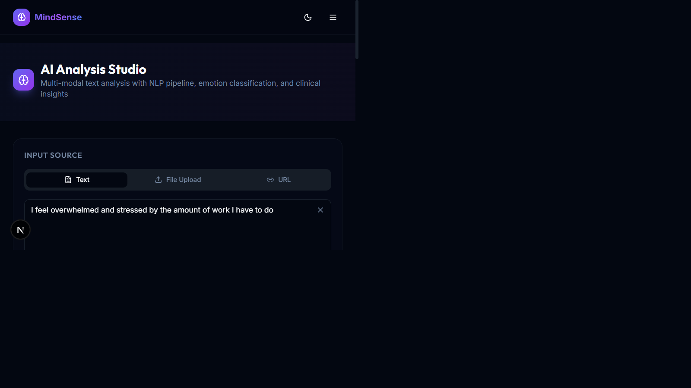

# MindSense AI

MindSense AI is a Next.js mental-health sentiment analysis application. It analyzes text for emotional signals such as stress, anxiety, depression, and happiness, then presents sentiment scores, risk indicators, sentence breakdowns, insights, and recommended assessments.

## Features

- Text, file, and URL analysis inputs
- Emotion scores for Depression, Anxiety, Stress, Happiness, Anger, Fear, Sadness, and Neutral
- Sentiment, confidence, risk-level, language, and sentence-level results
- Interactive analysis dashboard with charts and insight tabs
- PHQ-9 and GAD-7 assessment pages
- MongoDB Atlas persistence for users and authentication data
- Email/password authentication with JWT cookies
- Google OAuth sign-in
- Protected dashboard, profile, and admin routes
- Local analysis fallback when the optional transformer runtime is unavailable

## Screenshots

### Home



### Sign In



### Analysis Results



## Technology

| Area            | Technology                                                       |
| --------------- | ---------------------------------------------------------------- |
| Web application | Next.js 15, React 19, TypeScript                                 |
| UI              | Tailwind CSS, Radix UI, Recharts, Lucide                         |
| Authentication  | JWT cookies, bcryptjs, Google OAuth 2.0                          |
| Database        | MongoDB Atlas with Mongoose                                      |
| Analysis        | TypeScript emotion scoring with optional Transformers.js runtime |
| Runtime         | Node.js 18 or newer                                              |

## Project Structure

```text
frontend/
  app/                 Next.js App Router pages and API routes
  components/          Shared UI and analysis components
  context/             Authentication context
  lib/                 Frontend helpers and types
backend/lib/            Shared database, authentication, email, and analysis logic
database/models/        Mongoose models
ml-service/             Optional Python ML service
```

The primary application currently runs from `frontend/`. The Next.js API routes use shared code from `backend/lib/` and the Mongoose model in `database/models/`.

## Requirements

- Node.js 18 or newer
- npm
- MongoDB Atlas account or a local MongoDB server
- Google Cloud OAuth credentials for Google sign-in

## Setup

Install the frontend dependencies:

```powershell
cd frontend
npm install
```

Create `frontend/.env.local`:

```env
MONGODB_URI=mongodb+srv://<user>:<password>@<cluster>.mongodb.net/mindsense
JWT_SECRET=replace-with-a-long-random-value
NEXT_PUBLIC_APP_URL=http://localhost:3000

GOOGLE_CLIENT_ID=your-google-client-id
GOOGLE_CLIENT_SECRET=your-google-client-secret
GOOGLE_REDIRECT_URI=http://localhost:3000/api/auth/google/callback
```

In Google Cloud Console, add the redirect URI above under the OAuth client configuration. Never commit `.env.local` or expose database and OAuth secrets.

Start the application:

```powershell
npm run dev
```

Open [http://localhost:3000](http://localhost:3000).

If port 3000 is already in use, start on another port:

```powershell
$env:PORT = "3003"
npm run dev
```

## Analysis Example

Input:

```text
I feel overwhelmed and stressed by the amount of work I have to do
```

The current deterministic fallback reports this as negative with Stress as the dominant emotion. Scores are generated for display and wellness guidance; they are not a medical diagnosis.

## Useful Commands

Run from the repository root:

```powershell
npm --prefix frontend run dev
npm --prefix frontend run build
```

Run type checking:

```powershell
cd frontend
npx tsc --noEmit
```

## API Endpoints

| Method | Endpoint                    | Purpose                              |
| ------ | --------------------------- | ------------------------------------ |
| POST   | `/api/analyze`              | Full analysis workflow               |
| POST   | `/api/analyze-text`         | Lightweight legacy analysis endpoint |
| GET    | `/api/auth/me`              | Read the current session             |
| POST   | `/api/auth/register`        | Create an account                    |
| POST   | `/api/auth/login`           | Sign in with email and password      |
| POST   | `/api/auth/logout`          | Clear the auth cookie                |
| GET    | `/api/auth/google`          | Start Google OAuth                   |
| GET    | `/api/auth/google/callback` | Complete Google OAuth                |
| POST   | `/api/survey`               | Submit an assessment                 |

## Privacy and Safety

MindSense AI provides informational sentiment and wellness guidance only. It does not diagnose mental-health conditions or replace professional care. Do not submit sensitive personal information unless the deployment has been configured and reviewed for the required privacy controls.

## Current Limitations

- The optional Transformers.js path may require a platform-compatible native `sharp` installation. The application falls back to deterministic keyword scoring when that runtime is unavailable.
- SMTP is optional in local development; email operations require SMTP configuration for real delivery.
- Google OAuth requires valid credentials and an exact registered redirect URI.
- The lightweight `/api/analyze-text` endpoint is retained for compatibility and does not provide the same scoring model as `/api/analyze`.
